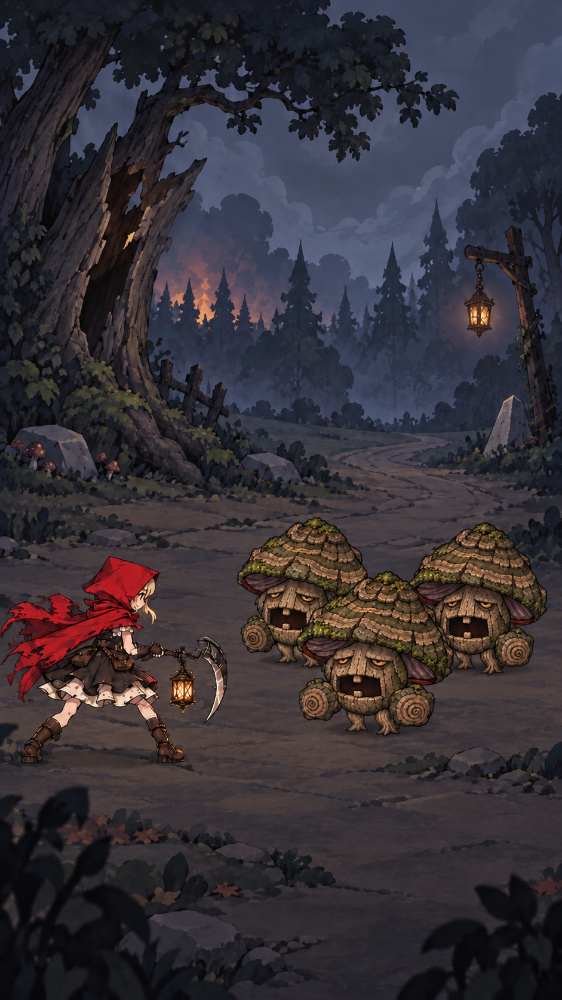
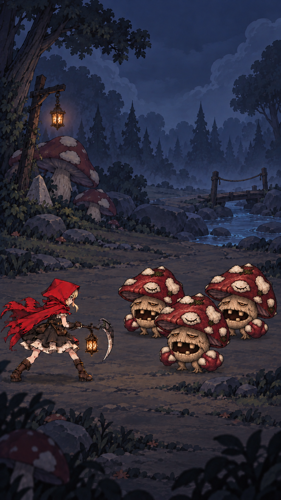
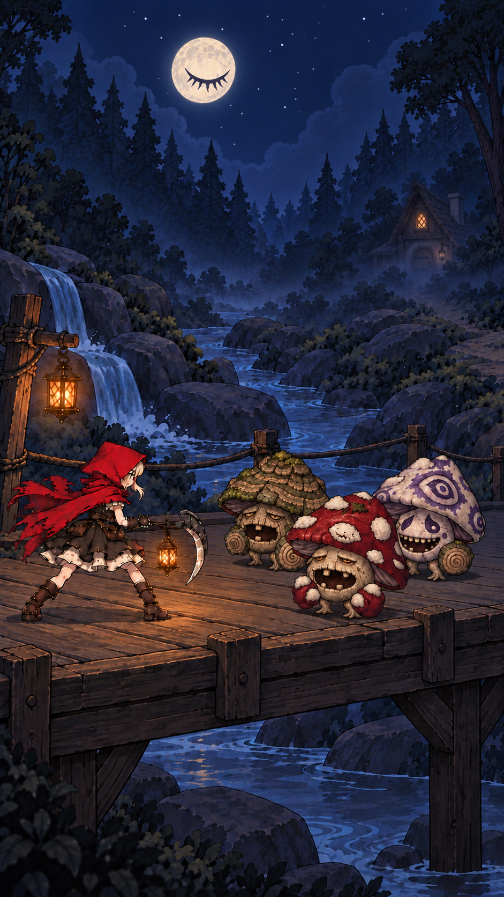
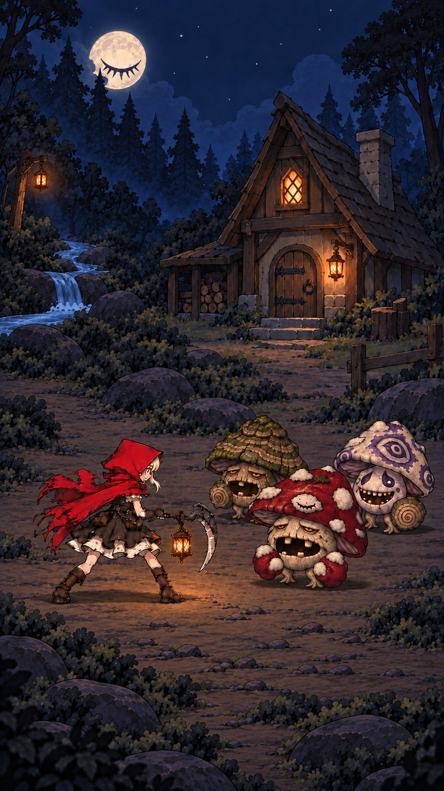
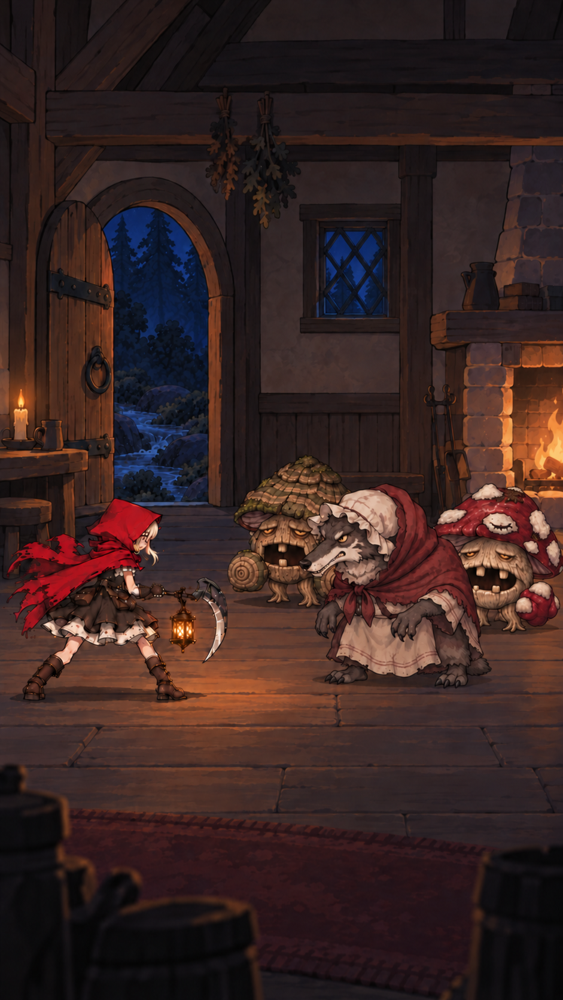

# 第一章连续场景设定

归档日期：2026-10-10。当前采用五张 V8 场景概念图，顺序为暮色林缘、蘑菇森林、月下过桥、溪畔小屋、小屋内部。用于美术制作与场景衔接参考；角色与三敌人为战斗构图示意，不代表正式每波敌人配置。概念图不等同于 Unity 已落地场景或可编辑 UI。

[五图总览](overview.html) · [本轮局部修改提示词](design-and-prompts.json)

## 共同制作规则

- 竖屏 9:16，以黑暗童话加卡通元素为方向。背景细节与对比度服务于角色和怪物的辨识，避免写实质感过重。
- 主角在左，面向右侧整个敌群。三只敌人采用紧凑三角站位，前方一只与主角处于同一战斗纵深，后方两只略错位；允许局部遮挡，禁止排成直线或拉开成远距离队列。
- 路线由村庄边缘向森林深处推进。第一节左后方火光，第二节不再出现背景村庄火光；第二节预告桥，第三节站上桥，第三节远处预告小屋，第四节到达同一小屋，第五节进入室内。
- 第一节将入夜，第二节进一步变暗，第三节起完全入夜。第三、第四节保留带眼睛的月亮，第五节窗外不显示月亮。
- 蘑菇环境集中在森林段，小屋与屋内陈设不附加装饰蘑菇；示意敌人不属于建筑装饰。
- 不添加强烈箭头引导。小屋造型和室内陈设需与角色保持可信比例。

## 第一节 暮色林缘

灰暗的将夜天空，左后方保留村庄火光，表现刚逃离村庄。行进方向向右。

## 第二节 蘑菇森林

深入森林，蘑菇与提灯构成环境特征。背景不再出现村庄火光；远处桥梁预告下一节。

## 第三节 月下过桥

完全入夜，主角和三只怪物均站在宽桥桥面，桥有纵深但战斗站位紧凑。远处右侧隐约出现下一节的小屋，保留带眼睛的月亮。

## 第四节 溪畔小屋

过桥后到达同一座小屋，画面不再出现桥。溪流从背景流下，在画面中段向左流出画外；前景战斗区为连续干地，主角双脚与三只怪物全部落在地面上。房屋不长蘑菇。

月亮大小和高度与第三节基本一致，保留树冠局部遮挡。镜头略向右朝小屋取景，可以解释月亮在画面中向左移动；近处树冠的视差解释遮挡变化。此为当前构图的衔接解释，后续镜头实现应遵守；若采用严格固定朝向，应重新校准月亮的屏幕位置。

## 第五节 小屋内部

进入第四节同一小屋，延续门窗造型与童话比例。窗外为夜色与树影，不显示带眼睛的月亮。角色、敌人与家具保持可读且协调的尺度。图中狼外婆与两只蘑菇用于三敌人构图示意，正式战斗配置另行确定。

## 版本范围

本次归档图片原样复制自 V8。相对前版，仅第四节调整溪流出口与干地，第五节移除窗外月亮；前三节不变。第三、第四节月亮关系经讨论保留。本目录保存美术设计参考图，不包含游戏实景验证截图。

## 当前游戏站位实现

现有 Gameplay 已按本套设定调整普通怪的三角站位与尺寸，详见[实现与实景验证](formation-validation.md)。
