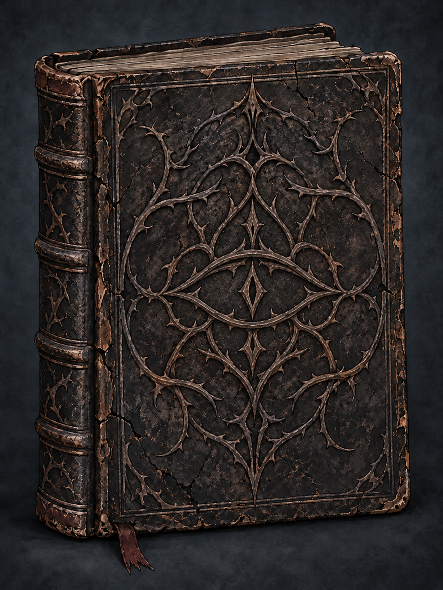

# 诅咒童话书 — 已确认设定

确认日期：2026-10-09。用户已确认 v4 邪眼封面，作为游戏设定保留。

## 正式视觉参考

- 正式参考：`cursed-book-approved.png`
- 生成提示词：`cover-prompt.txt`（内置 imagegen 生成）
- 原始版本：`../../output/imagegen/cursed-storybook-v4/cursed-book-evil-eye.png`

## 书与游戏的关系

游戏围绕一本非常古老的诅咒童话书展开，小红帽穿梭不同世界的历险在书中呈现。整体融合黑暗童话、上古邪神、多维世界、猎奇与轻微恐怖。

开场聚焦这本书；翻开后呈现小红帽的基础能力与主界面；开始战斗时翻到战斗场景页；其他页面承载其他功能与剧情介绍。具体翻页交互与内页布局尚未定稿。

## 已确认的封面规则

- 书是古老、深邃、令人不安的诅咒之物；封面不出现小红帽或其他主角形象，不出现城堡、森林等故事背景插画，不做游戏宣传画式封面。
- 以黑褐色龟裂旧皮革、磨损书脊、厚重灰旧书页和暗色荆棘纹样表现年代感。
- 中央为邪眼纹章：横向眼形轮廓与抽象菱形瞳心，融入周围荆棘纹样。
- 邪眼仅通过同材质压纹和纹路表达，不能画成真实眼球；保持抽象、古老封印般的质感。
- 采用已确认图中的无书名封面与克制配色。诡异感来自纹样和材质。
- “斜眼”是用户输入笔误，已更正为“邪眼”；v3 斜置纹章不是最终设定。

## 与战斗 UI 的衔接

“UI 设计”会话已确认 B3「诅咒童话」方向：灰旧纸页、黑色荆棘墨绘、城堡剪影、暗红蜡封。内页与 UI 可沿用这套绘本语言，封面遵循上述独立约束，不将场景插画搬到封面。

本次确认范围为书的整体概念及 v4 封面。早期概念中的展开内页仅为探索稿，尚未确认；当前尚未接入 Unity。
