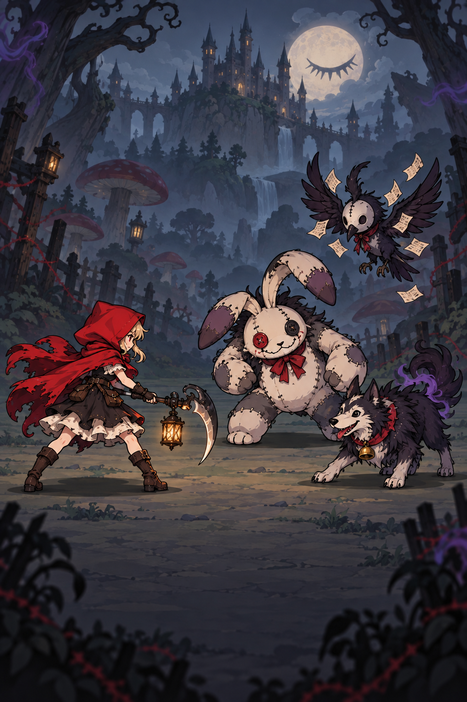

# 怪物制作手册

适用于 Idle Dark Fairytale 的 Spine 怪物制作、导入、动画预览和战斗接入。美术、动画和程序均以此作为交付与验收依据。

当前规范版本：1.2。更新日期：2026 年 10 月 9 日。

最小可战斗怪物需要 **4 个基础动画、2 种事件、至少 1 套可用皮肤、完整导出资源、配置正确的敌人预制体，以及资源注册和波次配置**。动画能在测试场景播放，只代表预览可用，不等于已完成战斗接入。

本文中“必需”是新怪物的交付要求；“建议”是制作默认做法；“可选”按怪物设计决定。当前实现特有的要求在相关条目中明确标注。旧资源中的缺项不是新资源的制作标准。

## 世界观与整体美术方向

### 已确定的创作基础

世界观以黑暗童话、古老邪神和多空间切换为基础。主角是小红帽，旅程起点是受到邪神精神污染的黑森林，并将穿梭于风格迥异的多维空间。精神污染的具体机制、小红帽对污染的认知，以及各空间之间的因果关系，随剧情设计进一步确定。

怪物整体采用 **微恐、猎奇、可爱** 的风格。不同空间拥有自己的怪物外形、材质、色彩和行为，邪神污染提供贯穿各空间的联系。黑森林的布偶、缝线、羽毛和枯木不是所有空间都必须使用的元素。

### 黑森林起始参考

这张图已被认可为起点方向，作为黑森林的气氛、角色关系和怪物尺度参考；具体角色设计、武器、怪物名单和后续空间仍可迭代。

| 画面要素 | 可沿用的设计语言 |
| --- | --- |
| 小红帽 | 红色兜帽形成主角辨识点，角色在低饱和环境中清楚可见 |
| 黑森林 | 冷灰蓝雾气、扭曲树木、巨型蘑菇、远处城堡；暖灯光提供局部温度和空间层次 |
| 缝补兔偶 | 圆润躯体、长耳与纽扣眼保留可爱识别，缝线、不对称和不自然体量增加异样感 |
| 鸦偶 | 鸟喙、羽翼、面具式面部与飘动纸片组合，兼有神秘感和玩偶感 |
| 狼形怪物 | 明确动物轮廓和表情，搭配铃铛、蓬松毛发与异常烟气；威胁来自姿态和变化 |
| 月亮与污染 | 月面上的闭眼式图案、局部紫色烟气和不自然环境暗示被注视及精神异变 |

### 制作建议与恐怖尺度

以下是依据参考图提出的制作默认原则，用于概念设计和验收；不等同于已确定的剧情设定。

- **先有亲近的原型，再有异常。** 动物、玩偶、食物、日常器物等原型应容易识别，再叠加一至两个主要异常，避免所有部位同时异化。
- **可爱来自轮廓与性格。** 使用清楚的大形、适度夸张比例、笨拙或有情绪的动作；不要求所有怪物都圆胖，也不把可爱等同于无害。
- **猎奇来自违反常识。** 可使用错位影子、异常比例、不对称、物件活化、反常动作和空间错觉。异样感不必依赖血腥。
- **微恐保留观赏舒适度。** 默认避免写实内脏、开放性创伤、大面积血液和高密度寄生孔洞。缝线可表现布偶工艺，异变可用烟雾、纸片、空壳或材质变化表达。
- **邪神污染不限定为触手和眼球。** 凝视、梦境、重复符号、认知错乱或影子异常都可成为设计手段；并非每只怪物都要携带同一种符号。
- **背景营造压迫，角色保持可读。** 不以整体压黑代替气氛；怪物轮廓、攻击准备和命中瞬间应在手机画面中清楚。
- **动作延续风格。** 待机表现性格，攻击可以夸张但命中可读，受击保留弹性或滑稽感，死亡可倒伏、失去支撑或化为与材质相符的碎片，避免突然切换成重度恐怖表现。

普通怪物优先维持亲近原型和单一主要异常。精英与 Boss 可以增加体量、仪式感、结构反常和行为变化，但不默认提高血腥程度。

### 多空间设计方式

跨空间保持统一的是手绘表现的协调性、角色可读性、微恐尺度，以及四个基础动画和战斗事件规范。空间之间主动改变原型来源、材质、主色调、运动方式与污染表现，避免只给黑森林怪物换色。

每个新空间先填写空间设计卡，再制作怪物。除黑森林外，具体空间名称与题材尚未在本规范中确定。

| 设计卡字段 | 需要回答的问题 |
| --- | --- |
| 空间主题 | 这里的生活、规则和视觉印象是什么？ |
| 原生角色来源 | 怪物来自当地什么动物、物件、职业或传说？ |
| 主材质与配色 | 用哪些形状、材料和颜色与其他空间区分？ |
| 污染方式 | 邪神如何扭曲这里已有的规则？ |
| 可爱来源 | 轮廓、表情、行为中哪一点让人愿意持续观看？ |
| 主要异常 | 最容易被记住的一至两个反常特征是什么？ |
| 动作语言 | Idle1、Attack1、Hit、Death1 如何体现当地材质和性格？ |
| 空间关联线索 | 用什么少量重复线索让玩家感到这些空间属于同一旅程？ |
| 恐怖边界 | 本空间允许和避免哪些视觉表现？ |

美术验收还需确认：缩小后能识别原型和主要异常；不同空间的怪物有明显差异；与小红帽同屏时风格协调、主次清晰；静态和动态都保持微恐与可爱的平衡。

## 最小交付清单

| 内容 | 必需要求 | 完成标准 |
| --- | --- | --- |
| 可编辑源文件 | 原生 `.spine` 工程、引用的分件图片、导出和打包设置；记录编辑器版本 | 另一位制作者可以打开、修改并复现导出 |
| 骨骼和附件 | 完整初始姿态、正确骨骼绑定、槽位层级和附件引用 | 无丢图、破面、错误遮挡或异常缩放 |
| 基础动画 | `Idle1`、`Attack1`、`Hit`、`Death1` | 名称大小写一致，动作和切换正常 |
| 动画事件 | 定义 `OnHit`、`OnComplete`，并在规定时间线上实际插入 | 命中、回待机和死亡销毁按预期发生 |
| 皮肤 | 至少一套名为 `1` 的皮肤 | 单皮肤预制体设置 `maxSkins = 1` |
| 导出资源 | JSON 或二进制骨骼、atlas.txt、全部图集 PNG | 当前 Spine Runtime 可读取且附件齐全 |
| Unity 资源 | SkeletonDataAsset、Atlas 资源、正确材质和纹理设置 | 无缺失引用，透明边缘正常 |
| 怪物预制体 | 敌人组件、血条、显示对象、位置引用和入场配置 | 可在实际战斗中生成、攻击、受击和销毁 |
| 数值与出场 | 属性、攻击间隔、音效、经验与掉落策略、资源键和波次配置 | 实际生成使用正确资源和参数 |
| 验收记录 | 动画与事件检查结果、视觉预览、战斗测试结果 | 可以追踪源文件、导出版本和遗留问题 |

源文件是可维护交付要求，不需要放入 Unity 的运行资源目录。已有外部素材缺少源工程时，应记录为“仅有导出数据”；可以评估导入，但不能标记为完整可编辑交付。

## 基础动画规范

### 原模型动画复用优先

对已有 Spine 模型进行换皮时，优先保留经验证的原骨架、IK、插槽、加权网格及动画曲线。先将新皮肤适配原分件，不能为了省去贴图适配而重做简化骨架或用粗略动作替换原动作。

- 待机、攻击、死亡等原动作可通过增加别名适配游戏命名；保留原动作，事件只补在游戏别名中。战斗只统计精确且连续的 `Attack1`、`Attack2`…，不能把小写原名或其他包含 attack 的动作重复计数。
- `Hit` 先检查原受击动作是否合适。持续眩晕不能直接当作短促受击；没有合适动作时，才在原骨架上补做并明确标注来源。
- 导入记录列出“原样复用、增加别名／事件、补做”三类变更；自动比对原骨骼和动画时间线，确认未无意改写原曲线。
- 朝向在 Unity 显示节点翻转；原模型的网格、UV、权重和动画方向不得为了朝左而整体改写。
- 全动作检查菌帽／头部、手臂／拳头、脚部接缝与死亡遮挡；保留原骨骼不代表新皮肤自动通过视觉验收。

| 动画名 | 作用 | 播放要求 | 必需的事件 |
| --- | --- | --- | --- |
| `Idle1` | 待机和动作结束后的恢复状态 | 自然循环，避免接缝跳变和角色持续位移 | 无；不要添加触发战斗结算的事件 |
| `Attack1` | 最基础的一次攻击 | 具有可读的准备、命中和收招；结束后能接回待机 | 命中帧一个 `OnHit`，结束位置一个 `OnComplete` |
| `Hit` | 受击和攻击被打断后的反应 | 短促可读，结束后能接回待机 | 结束位置一个 `OnComplete` |
| `Death1` | 死亡 | 非循环，结束前保持死亡姿态，不恢复站立 | 结束位置一个 `OnComplete` |

默认攻击采用单次命中。多段攻击属于扩展设计，按后文事件规则单独确认。

动画时长没有统一硬编码帧数。按怪物体型和战斗节奏制作，并结合 `waitBetweenAttacks` 在游戏内验证，避免下一次攻击调度干扰收招。角色动作可以有局部位移，但基础待机和连续攻击不能使落脚点不断漂移。

### 当前播放逻辑的约束

- 敌人初始化及动作完成后使用 `Idle1`，不会自动选择 `Idle2` 等扩展待机。
- 敌人攻击由代码随机选择 `Attack1` 至 `AttackN`。编号必须连续，不能只有 `Attack1` 和 `Attack3`。
- 当前代码按名称包含 `Attack` 或 `attack` 统计攻击数量，再拼接 `AttackN` 播放。不要在同一可战斗资源里保留 `Attack_preview`、`attack_old` 等会被计入的非正式动作。
- 当前攻击入口设置循环播放，再由自定义 `OnComplete` 切回待机。因此攻击完成事件缺失时，不能依靠动画自然结束来恢复待机。
- 敌人受伤不必定播放 `Hit`：攻击中受伤需要触发打断概率；非攻击状态受伤会播放受击。
- 命名为 `idle`、`attack_1`、`hit`、`die` 的外部素材可以在通用预览器中播放，但接入现有战斗前必须统一命名，或明确实现映射逻辑。

## 事件规范

事件必须同时满足“骨骼数据中存在事件定义”和“对应动画时间线上存在事件关键帧”。仅在事件列表中创建名称不算完成。

| 事件 | 所属动画 | 建议位置 | 当前实际作用 |
| --- | --- | --- | --- |
| `OnHit` | `Attack1` 及所有投入战斗的 `AttackN` | 武器或攻击表现真正命中的时刻 | 触发攻击音效、伤害结算及相关反馈 |
| `OnComplete` | 每个 `AttackN` | 收招结束位置 | 切回 `Idle1` |
| `OnComplete` | `Hit` | 受击恢复结束位置 | 切回 `Idle1` |
| `OnComplete` | `Death1` | 死亡动作结束位置 | 执行死亡完成逻辑并销毁怪物对象 |

制作要求：

- 基础单段攻击的 `OnHit` 必须早于 `OnComplete`；不要把两者放在同一时刻，避免切换轨道干扰命中处理。
- 每个有限动作只放一个完成事件；不要放在第 0 帧或动作中段提前结束动作。
- `Idle1`、`Hit`、`Death1` 不应携带攻击用 `OnHit`。
- 使用主动画轨道 0 进行当前基础战斗，额外轨道事件需要程序适配。
- `OnComplete` 是项目约定的 Spine 自定义事件，**不是 Spine 自带的 TrackEntry.Complete 回调**。自然播放结束不能代替该事件。
- 多个 `OnHit` 会多次调用当前伤害逻辑；代码不会自动把一次攻击伤害平分给多个命中。多段攻击必须同步评估总伤害和音效次数。

验收时记录事件名称、时间位置和实际触发次数，同时覆盖攻击被打断和死亡中断场景。完整播放一次时，基础攻击应命中一次、完成一次；被提前打断时，不要求后续事件继续触发。

## 骨骼美术与皮肤

### 必需要求

- 分件图片有正确透明通道；槽、附件路径和图集区域一一对应。
- 关节位置、权重和遮挡顺序在全部动作中正确；不出现裸露接缝、拉裂或部件突然消失。
- 初始姿态可以正常显示，动画切换不能依赖上一动作遗留的错误附件状态。
- 朝向、角色比例和地面接触位置以同站位的原怪物为参照。保留源美术与骨骼内部一致的朝向，需要朝左时优先在 Unity Prefab 的 SkeletonAnimation 显示节点统一水平翻转；血条和文字独立处理，不逐个镜像贴图或强改骨骼朝向。统一预览器必须使用同一显示缩放。
- 视觉验收必须对照概念图检查部件透视、连接、遮挡及待机／攻击／受击／死亡关键帧。事件和顶点检查通过不能代替视觉验收。
- 当同一部件需要同时位于头部前后（例如蘑菇帽、兜帽、环绕式衣领）时，应拆成前后渲染层：后层 → 头／身体 → 前层。不能仅调整整张贴图的层级。前后层共用相应骨骼，并复核连接处在蓄力、命中、受击极值和倒地中的遮挡；三色变体均须检查。
- 不把命中闪光、伤害数字或场景背景烘焙进角色主体贴图；项目已有的战斗反馈由对应系统负责。

### 皮肤命名

当前 `Enemy.Start` 随机选择 `1` 至 `maxSkins`，再用数字字符串调用 `SetSkin`。

- 单皮肤：包含 `1`，并设置 `maxSkins = 1`。
- 多皮肤：包含连续的 `1`、`2`、…、`N`，并设置 `maxSkins = N`。
- 仅存在 `default` 不满足当前代码要求；皮肤数量也不能直接按包含 default 的导出列表长度填写。
- 所有可随机到的皮肤都必须检查四个基础动画，避免部分皮肤缺附件。

### 可按设计选用的美术技术

网格变形、加权蒙皮、IK、剪裁、飘带、武器和独立表情均不是最低门槛。选择能满足动作质量的简单实现；需要高级效果时，同时记录对 Spine 版本、材质、绘制顺序和运行性能的影响。

## 导出与 Unity 导入

当前项目使用 Spine 3.8 系列 Runtime。按 3.8 兼容格式交付，并记录实际导出编辑器版本。不要仅修改 JSON 的版本字符串就宣称完成了格式转换；更换 Runtime 大版本时，需要一起评估全部既有资源。

当前工作区已移除 JSON 加载器对 `3.8.75` 的显式拒绝判断。该修改仅消除这一处异常，不证明骨骼、图集或其他项目的 Runtime 都兼容，也不适合作为通用导出规则。

| 文件 | 要求 |
| --- | --- |
| `<怪物ID>.json` 或 `<怪物ID>.skel.bytes` | 骨骼、皮肤、动画和事件数据；交付一种运行格式即可 |
| `<怪物ID>.atlas.txt` | Unity 可导入的图集描述；使用当前解析器支持的布局格式 |
| 图集 PNG | 提供 atlas 引用的所有页面，文件名完全一致 |
| 导出与打包配置 | 保存在源文件目录，供后续复现，不必导入 Unity |

将运行资源放在同一怪物目录，等待 Spine 导入器生成 `SkeletonDataAsset`、Atlas 资源及材质。若已有导出数据且验证可用，不必重复导出；若图集格式不兼容，仅改扩展名无法修复。

### 透明度和材质

当前项目使用 Linear 色彩空间。先确定贴图是预乘 Alpha（PMA）还是直通 Alpha，再配套设置导入参数与材质。

项目中 mon_7070 的已验证导入副本采用：将原 PMA 像素转换为直通 Alpha，材质启用 `Straight Alpha Input`，纹理启用 `Alpha Is Transparency`，关闭 Mip Maps 和压缩用于检查。此流程不能不加判断地重复应用到已经是直通 Alpha 的图片。

逐项检查黑边、白边、透明矩形、半透明区域颜色和缩小后的轮廓。多页图集需逐页检查。正式发布的纹理尺寸和压缩按目标设备验证，不把预览阶段的无压缩设置当作全部资源的最终标准。

## 敌人预制体和游戏配置

优先复制结构相近的原敌人预制体，再替换骨骼资源和数值。不要只把 `SkeletonAnimation` 对象拖入场景就当作完整敌人。

| 配置 | 接入要求 |
| --- | --- |
| `Enemy` | 正确的 `maxSkins`、`waitBetweenAttacks`、`expGiven`、音效键、掉落列表及 `rootPos` 引用 |
| `Actor_Base` | `isPlayer = false`，配置基础属性、攻击打断概率及相应 Boss 属性 |
| `SkeletonAnimation` | 指向新 `SkeletonDataAsset`，检查可见性、比例、朝向和材质 |
| `EnemyLifebar` | 血条组件和 UI 引用完整，普通怪／小 Boss／Boss 显示类型正确 |
| `DropIn` | 检查下落入场、落地位置、血条与角色缩放恢复，以及落地后开始攻击 |
| `rootPos` | 调整受击粒子和伤害数字使用的位置，避免出现在脚底或角色之外 |
| 音效与掉落 | 引用有效音效键；经验和掉落可为零或空列表，但应明确配置 |
| 资源注册 | 在项目敌人数据库中配置唯一键及 Addressables 预制体引用 |
| 波次 | 波次 enemies 列表使用相同资源键，实际能生成该怪物 |

**当前子节点顺序是代码约束：** `DropIn` 把根对象的第 0 个子节点当作血条、第 1 个子节点当作角色显示对象；`Actor_Base` 也从第 0 个子节点取 `EnemyLifebar`。保留这一顺序，或先修改并验证引用方式，再调整结构。

敌人查找使用 `LevelDataDescriptions.EnemyDb` 的 `key` 和 `assetRef`；只有 Addressables 地址而没有数据库记录仍不够。现有 `maxAttacks` 会在启动时根据骨骼动画重新计算，不能靠手动填写该字段解决动画命名错误。

## 可选扩展

| 扩展 | 制作内容 | 是否需要额外程序适配 |
| --- | --- | --- |
| 更多普通攻击 | 连续命名 `Attack2` 至 `AttackN`；各自配置命中和完成事件 | 当前可随机选择；独立权重、冷却或伤害倍率需要适配 |
| 多套皮肤 | 连续数字皮肤并更新 `maxSkins` | 当前支持随机皮肤；按关卡或稀有度指定需要适配 |
| 多段攻击 | 一次动画含多个 `OnHit` | 现有逻辑会多次结算；分段伤害规则需要适配 |
| 额外待机 | `Idle2`、`Idle3` 等 | 需要增加待机选择逻辑 |
| 跑动与移动 | `Run1` 或约定的移动动画 | 当前基础敌人不调用，需要移动状态逻辑 |
| 专用出场 | 如 `Spawn` | 需要协调现有 DropIn 入场和攻击开始时机 |
| 技能攻击 | 如 `Skill1`，附技能表现和事件设计 | 需要技能调度及事件处理；仅创建动画不会自动施放 |
| 眩晕与控制 | 如 `Stun` | 需要控制状态、时长、打断和恢复逻辑；循环眩晕不能照搬基础动作完成规则 |
| 多种死亡 | 如 `Death2` | 当前死亡固定播放 `Death1`，需增加选择逻辑 |
| 胜利或复活 | 如 `Victory`、`Rebirth` | 需要状态切换、属性恢复和对象生命周期适配 |
| 附件替换与高级材质 | 武器替换、发光、特殊混合等 | 按所用效果检查运行时和渲染支持 |
| Boss 阶段变化 | 阶段动画、换肤、专用攻击和转场 | 需要阶段规则、伤害配置和转场中断策略 |

本表中的扩展命名是项目建议，不代表当前敌人代码已支持。新增事件名需要和程序约定；只有动画工具中的事件定义不会产生新的游戏行为。

## 目录与日常制作流程

建议每个怪物使用稳定 ID，例如 `mon_7070`，并保留“源文件—导出文件—Unity 资源—预制体键”的对应关系。

| 用途 | 位置或约定 |
| --- | --- |
| 当前外部源素材 | 项目同级目录 `../Spine/monster/<怪物ID>/` |
| 当前约定的外部导出位置 | 项目同级目录 `../Spine/export/monster/`；新增批量资源建议按怪物 ID 分子目录 |
| 新怪物预览资源 | 项目内 `Assets/Tests/Monsters/<怪物ID>/` |
| 统一测试场景 | 项目内 `Assets/Tests/MonsterAnimation/MonsterAnimationTest.unity` |
| 原怪物美术 | 项目内 `Assets/Grfx/Enemies/` |
| 原怪物预制体 | 项目内 `Assets/Prefab/Addressable Prefabs/Enemies/` |

项目内 `Spine/mon_7070/` 是已有导出归档，与项目同级的 `../Spine/` 素材库不是同一个目录。避免覆盖混淆。若将通过验收的资源从 Tests 移到正式目录，使用 Unity 移动并保留 `.meta` GUID，同时更新测试器扫描目录或手动资源列表。

1. 确认怪物 ID、体型、站位、参考美术和是否需要扩展。
2. 准备分件，建立骨骼、皮肤和初始姿态。
3. 制作四个基础动画，并按时间线配置事件。
4. 使用匹配版本导出骨骼和图集，记录设置。
5. 导入 Unity，处理材质透明度，进入统一测试场景检查。
6. 复制原敌人预制体，替换资源并配置属性和位置引用。
7. 注册敌人资源键，放入可验证的波次，运行真实战斗。
8. 保存验收记录，归档源文件及设置；更新资源时重复相关检查。

## 战斗同屏构图

怪物设计还需要在实际场景中验收，不能只看透明底单体图。至少保存单怪和双怪的游戏截图，确认：

- 主角、攻击目标和后排怪物的脸、武器与主要轮廓可辨认，后排遵循近大远小；站位必须落在背景的可行走地面上。
- 血条不得覆盖其他角色的头、帽檐或攻击动作。黑森林普通怪采用独立脚下血条，紧凑尺寸、暗红与骨白配色。
- 角色与环境保持一致的冷暖、明暗和接触阴影；眼睛及主角红披风可保留暖色识别点，避免所有素材同样鲜亮而失去主次。
- 不同配色共用结构和连接标准，缩小到游戏实际显示尺寸后再次检查。先解决构图与比例，再增加纹理细节。

## 统一场景验收

打开 Unity 菜单 `Tools > Dark Fairytale > Monsters > Open Test Scene`，点击 Play。无需为每个怪物创建场景。

编辑器 Play 模式默认扫描 `Assets/Tests` 下的 SkeletonDataAsset；其他目录通过 `Discovery Folders` 或 `Monsters` 数组加入。保存用于独立构建的列表时，退出 Play，执行 `Refresh Monster List` 并保存场景。

逐一检查：怪物切换、皮肤完整性、全部动画、暂停与重播、循环与自动轮播、不同速度及缩放、落脚点、遮挡和透明边缘。当前测试面板没有皮肤切换控件，多皮肤验收需要在 Inspector／专用检查代码中逐套设置，不能只看默认皮肤。

菜单 `Validate Imported Monsters` 会采样动画并检查加载和有限顶点，报告保存到 `output/monster-animation/validation.txt`。**当前自动验证不检查四个基础动画是否齐全、事件关键帧及次数、全部皮肤或完整战斗链路。** 这些必须另行核验；PASS 不能直接视为制作完成。

## 交付验收表

### 资源和动画

- [ ] 所属空间和怪物设计卡明确，外形与动作符合微恐、猎奇、可爱的整体方向。
- [ ] 源工程、分件、版本和导出设置已归档，可重现导出。
- [ ] 骨骼和图集可在当前 Runtime 加载，所有图集页面和附件齐全。
- [ ] 四个基础动画名称精确匹配，无会干扰攻击数量统计的临时动画。
- [ ] 待机循环自然；攻击、受击可接回待机；死亡结束不恢复站立。
- [ ] 每个攻击有正确数量和时机的 OnHit，并在收招结束有一次 OnComplete。
- [ ] Hit 和 Death1 各有一次 OnComplete；事件定义及时间线均存在。
- [ ] 皮肤为连续数字名称，maxSkins 匹配；逐套检查全部基础动画。
- [ ] 材质透明度、接缝、落脚点、方向和尺寸已在 Unity 检查。

### 战斗接入

- [ ] 预制体组件、子节点顺序、血条和 rootPos 引用正确。
- [ ] 资源数据库、Addressables、波次键一致，能实际生成怪物。
- [ ] 入场结束后开始战斗，攻击命中次数、伤害和音效符合设计。
- [ ] 攻击及受击正常返回待机，攻击被打断时无残留错误状态。
- [ ] 死亡动画完整播放后销毁对象，经验与掉落正确，波次可继续。
- [ ] 连续生成、击杀和多怪同场正常，无缺引用或异常日志。
- [ ] 扩展动作有明确触发逻辑，不能触发的动作已标明仅供预览。

### 交付记录模板

- 所属空间、原型、主材质与配色：
- 主要异常、可爱来源、污染表现与恐怖边界：
- 怪物 ID 与显示名：
- 普通怪／小 Boss／Boss：
- 制作者与更新日期：
- Spine 编辑器版本与 Runtime 版本：
- 源工程和导出目录：
- 骨骼资源、预制体、资源键和验证波次：
- 皮肤名称与 maxSkins：
- 动画名称、时长及用途：
- 各动画事件名称、时间位置、预期与实测次数：
- 贴图 Alpha 类型、导入参数和材质：
- 基础属性、攻击间隔、音效及掉落策略：
- 预览截图／视频与验证报告：
- 资源验收结果、战斗验收结果、遗留问题：

## 现有资源的特殊情况

以下为 2026 年 10 月 9 日的核对结果，用于说明旧资源不能直接作为完整规范模板：

- 原项目 54 个敌人预制体引用 53 套不同骨骼；这些骨骼都有 OnHit 和 OnComplete 的实际使用，但不保证每个攻击配置完整。
- Bee1、JungleEnemy1、JungleMonster2 的 Attack1，以及 Sandboss 的 Attack3 缺少 OnComplete。制作新怪物时不要复制这一缺项。
- 当前 mon_7070 测试资源没有 OnHit 或 OnComplete，动画名也未统一为四个基础名称。它可以预览，但尚不满足本手册的战斗交付要求。
- 历史 mon_7070 导入副本把版本标记改为 3.8.99，是当时的兼容测试处理，不是正式转换流程。

## 项目实现参考

代码或导出管线调整后，同步更新本手册及验收规则。

- [Enemy.cs](../Assets/Scripts/Enemy.cs)：待机、攻击选择、皮肤、命中与死亡完成。
- [AnimationController.cs](../Assets/Scripts/Oneshark/AnimationController.cs)：事件路由、攻击数量统计和播放入口。
- [Actor_Base.cs](../Assets/Scripts/Actor_Base.cs)：受击、打断、死亡与血条引用。
- [DropIn.cs](../Assets/Scripts/DropIn.cs)：入场与子节点顺序。
- [AssetManager.cs](../Assets/Scripts/AssetManager.cs) 和 [WaveManager.cs](../Assets/Scripts/WaveManager.cs)：资源键、实例化和波次。
- [统一测试场景使用说明](../Assets/Tests/MonsterAnimation/README.md)：扫描目录、操作菜单及验证能力。
- [mon_7070 美术制作方案](mon7070-crow-doll.md)：单个怪物的视觉设计示例。

## 出场演出与战斗隔离

使用出场动画的怪物，出场必须有独立状态，完成前不能攻击、被选为攻击目标或承受任何伤害；伤害入口也必须兜底拦截，不能仅依靠隐藏血条。出场中的怪物仍计入当前波次存活数量。以动画实际 Complete 回调结束出场，不用固定等待时间代替。无出场动画的旧资源可保留现有入场流程。

黑森林蘑菇的约定为：冻结原 spawn 首帧下落 → 落地完整播放 spawn → 恢复血条并进入战斗。原首帧若为全透明，需单独处理可见性并做实景检查，不能只验证动画时间为零。当前实现仅在 Unity 恢复最初透明段的附件可见性，不改原骨骼动画数据。

## 蘑菇出场修订：原地生长（2026-10-09）

本条替代此前蘑菇“冻结首帧下落”的约定。三色蘑菇 Prefab 的 DropIn.spawnInPlace 开启，直接在最终站位播放原 spawn，从小变大后进入正常战斗。保持原动画透明度和骨骼时间线，不再应用首帧可见性补偿。动画完成前仍隐藏血条、禁止攻击与受击，并计入波次存活统计。其他怪物默认保持原下落流程；蘑菇构建器同步保存此设置，重建不会丢失。
